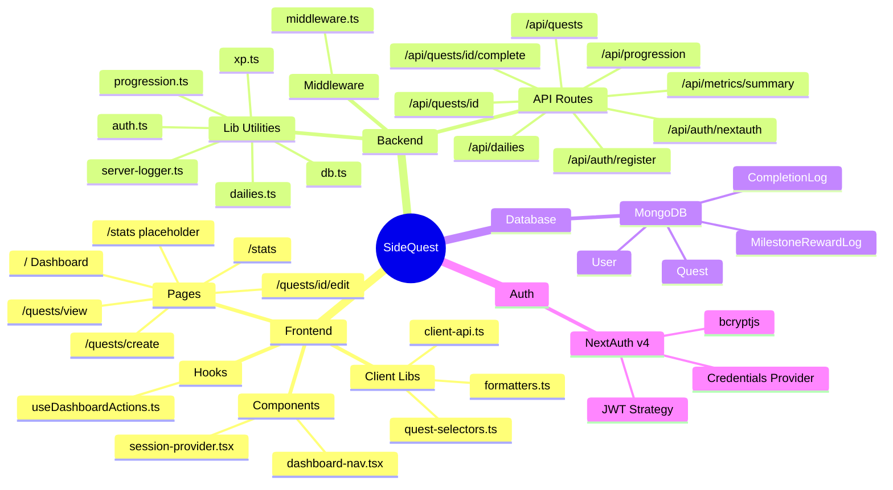
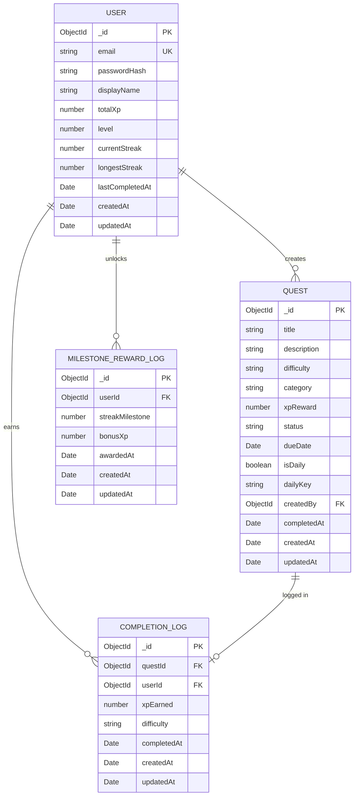
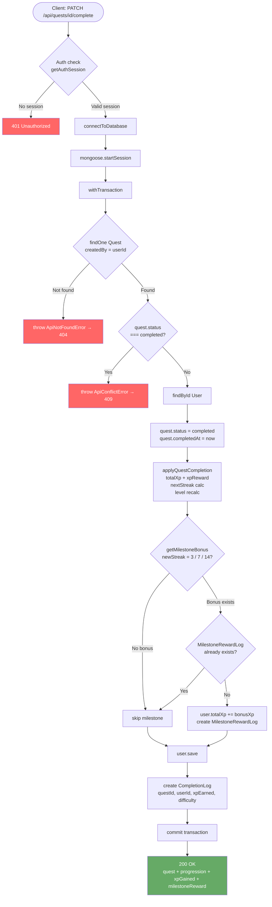
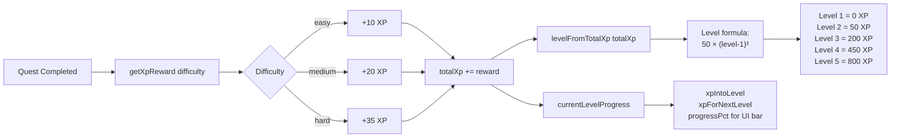
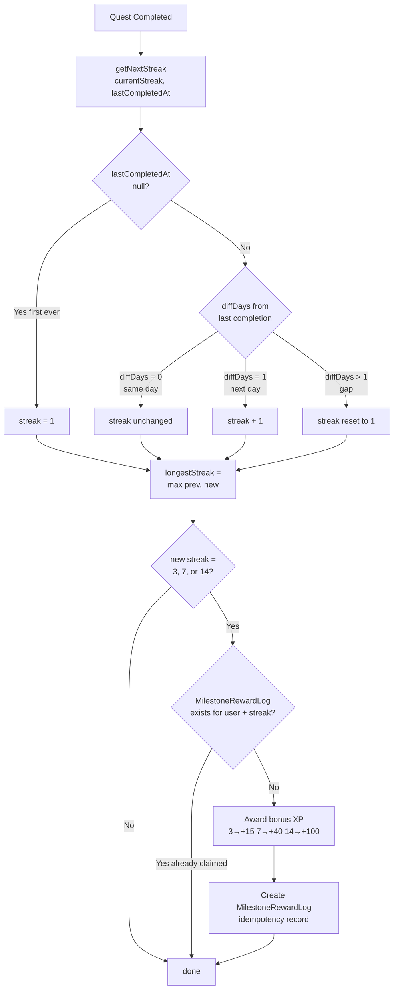
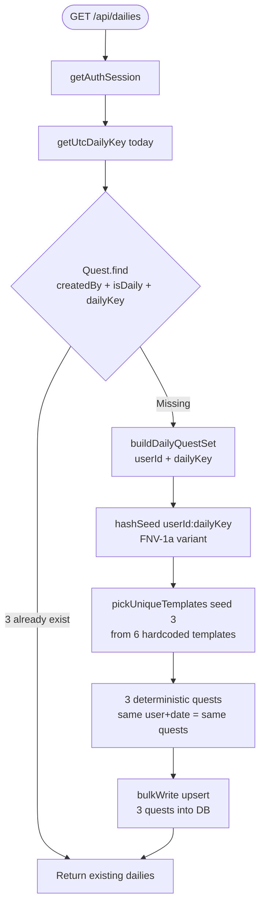
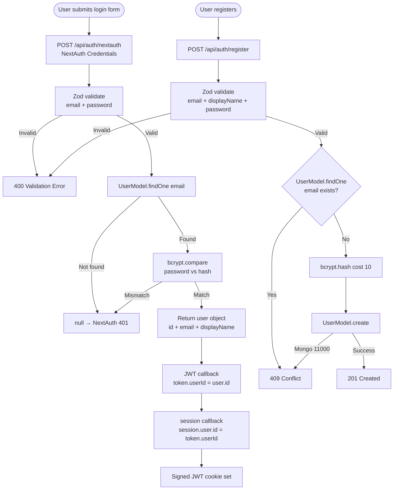
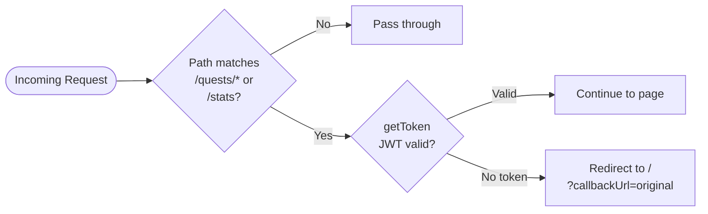
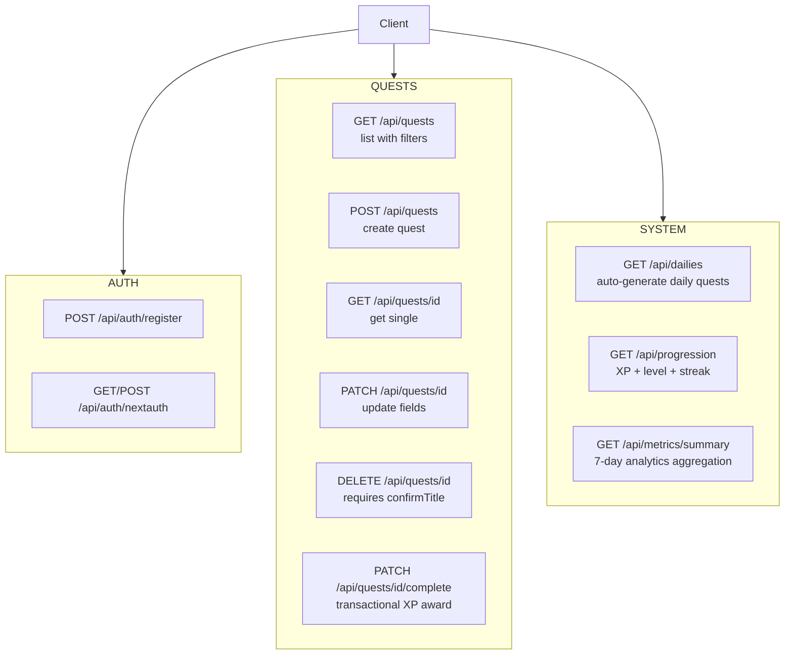

# SideQuest — Architecture Mind Map

> Render with any Mermaid-compatible viewer (GitHub, Obsidian, VS Code + Mermaid plugin).

---

## 1. Project Overview



---

## 2. Data Model Relationships



---

## 3. Quest Completion Flow (Core Transaction)



---

## 4. XP & Level Progression System



---

## 5. Streak & Milestone System



---

## 6. Daily Quest Generation



---

## 7. Authentication Flow



---

## 8. Middleware Route Protection



---

## 9. API Route Map



---

## 10. Frontend Data Flow

```mermaid
flowchart TD
    A([page.tsx mounts]) --> B[useDashboardActions hook]
    B --> C[fetchDashboardData]
    C --> D[GET /api/progression]
    C --> E[GET /api/dailies]
    C --> F[GET /api/quests?status=active]

    D --> G[profile state\nlevel xp streak progress]
    E --> H[dailies state\n3 daily quests]
    F --> I[quests state\nactive quest list]

    G & H & I --> J[Dashboard renders\nStats + Dailies + Quest cards]

    J --> K{User action}
    K -->|Complete quest| L[PATCH /api/quests/id/complete]
    L --> M[Show feedback toast\nXP gained + milestone?]
    M --> C

    K -->|View quests| N[/quests/view\nGET /api/quests?filters]
    K -->|Create quest| O[/quests/create\nPOST /api/quests]
    K -->|Stats| P[/stats\ncoming soon]
```

---

## 11. Directory Structure

```
src/
├── app/
│   ├── page.tsx                        ← Main dashboard
│   ├── layout.tsx                      ← Root layout + SessionProvider
│   ├── api/
│   │   ├── auth/
│   │   │   ├── register/route.ts       ← User registration
│   │   │   └── [...nextauth]/route.ts  ← NextAuth handler
│   │   ├── quests/
│   │   │   ├── route.ts                ← GET list, POST create
│   │   │   └── [id]/
│   │   │       ├── route.ts            ← GET, PATCH, DELETE
│   │   │       └── complete/route.ts   ← PATCH complete (transactional)
│   │   ├── dailies/route.ts            ← GET + auto-generate
│   │   ├── progression/route.ts        ← GET user stats
│   │   └── metrics/summary/route.ts    ← GET 7-day analytics
│   ├── quests/
│   │   ├── create/page.tsx
│   │   ├── view/page.tsx
│   │   └── [id]/edit/page.tsx
│   └── stats/page.tsx                  ← Placeholder
├── components/
│   ├── dashboard-nav.tsx
│   └── session-provider.tsx
├── hooks/
│   └── useDashboardActions.ts
├── lib/
│   ├── xp.ts                           ← XP reward + level formula
│   ├── progression.ts                  ← Streak + milestone logic
│   ├── dailies.ts                      ← Deterministic daily generation
│   ├── auth.ts                         ← NextAuth config
│   ├── db.ts                           ← MongoDB connection cache
│   ├── server-logger.ts                ← Query-gated structured logging
│   ├── client-api.ts                   ← Typed fetch wrapper
│   ├── formatters.ts                   ← UI helpers
│   └── quest-selectors.ts              ← Client-side filters (unused)
├── middleware.ts                        ← JWT route protection
├── models/
│   ├── User.ts
│   ├── Quest.ts
│   ├── CompletionLog.ts
│   └── MilestoneRewardLog.ts
└── types/
    └── next-auth.d.ts                  ← Session type extension
```
