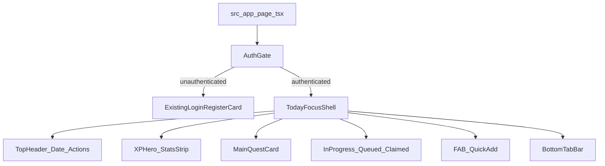

# Today/Focus UI-First Plan

## Missing Features vs Current State

From [documentation/current-status-architecture.md](documentation/current-status-architecture.md), [documentation/Design References/screens.jsx](documentation/Design References/screens.jsx), and [documentation/Design References/sidequest-demo.jsx](documentation/Design References/sidequest-demo.jsx), the app is missing most of the designed Home/TODAY experience:

- Current `/` in [src/app/page.tsx](src/app/page.tsx) is a simple authenticated dashboard with `Quick Actions`, not a task-focused mobile hub.
- Not implemented on Home yet:
  - App bar with date/context + search/menu actions
  - XP hero + segmented progress treatment for gamified mode
  - Stats strip (streak/daily goal/focus time)
  - Main Quest hero card with progress and "Start focus" action
  - Structured sections (`In Progress`, `Queued/Party Quests`, `Claimed`)
  - Floating quick-add action button
  - Mobile bottom tab bar shell for `Today/Quests/Calendar/Codex`
- Supporting design primitives shown in [documentation/Design References/screens-a.jsx](documentation/Design References/screens-a.jsx) are not represented as reusable components in `src/components` yet.

## Scope

- Build **Home Today/Focus UI only** for authenticated users.
- Use static/mock client-side data (hardcoded or local constants).
- No API wiring changes, no DB model changes, no route-handler changes.
- Preserve existing auth gate/login surface behavior in [src/app/page.tsx](src/app/page.tsx).

## 5-Phase Roadmap

### Phase 1: Home UI Foundation (Today/Focus)

- Replace authenticated dashboard content in [src/app/page.tsx](src/app/page.tsx) with a reusable Today/Focus UI shell.
- Create Home primitives for:
  - top app bar (`menu`, date/title, `search`) following `AppBar` and `TodayScreen` patterns in [documentation/Design References/sidequest-demo.jsx](documentation/Design References/sidequest-demo.jsx)
  - XP hero and quick stats strip (inspired by `WFXPBar` + stat cards from design references)
  - Main Quest hero card with progress and CTA
  - task rows and section headers for `In Progress`, `Queued`, `Claimed`
  - floating quick-add button and bottom tab bar
- Add strongly typed mock data module for Home sections only.
- Keep all interactions presentational with lightweight no-op handlers or local callbacks.

### Phase 2: Home Presentational Interactions

- Add local state toggles for visual states (active tab, section collapse, selected task highlight).
- Add client-only UI states for focus controls (`start`, `pause`, `resume`) without timers persisted to backend.
- Add empty/loading visual placeholders for each Home section while still using mock data.
- Ensure keyboard and touch behavior is consistent for buttons/chips/fab.

### Phase 3: Adjacent Screen UI Shells

- Build UI-only shells for Quest List, Calendar, and Codex, reusing Home primitives where applicable.
- Keep navigation presentational and route-safe (no API coupling).
- Align visual language (spacing, chips, section framing, bottom nav behavior) across shells.

### Phase 4: Detail + Quick Add UI

- Implement Quest Detail layout with subtasks/progress/focus area.
- Implement Quick Add bottom sheet UI (title capture + parsed chips + actions) as client-only.
- Wire UI transitions between Today, Detail, and Quick Add in a presentational manner.

### Phase 5: Polish + Handoff Readiness

- Responsive refinement for mobile-first and desktop container behavior.
- Accessibility pass (labels, focus states, semantic landmarks, contrast checks).
- Cleanup and codify component contracts so data wiring can replace mock data safely.
- Add handoff notes for future API integration boundaries.

## Refined Phase 1 Execution Plan (Ready To Start)

### Phase 1 Goal

Ship a complete UI-only Home (`Today/Focus`) screen that visually matches the design references and replaces the current authenticated dashboard surface.

### Phase 1 Boundaries

- In scope:
  - authenticated Home (`/`) visual replacement with Today/Focus UI
  - static mock data only
  - reusable UI components under `src/components/home`
- Out of scope:
  - API calls, DB integration, model changes, route-handler changes
  - Quest Detail, Quick Add sheet internals, Calendar/Codex screen builds
  - animation polish beyond basic transitions

### Design Reference Mapping (Source Of Truth)

- Use `TodayScreen` composition and section order from [documentation/Design References/sidequest-demo.jsx](documentation/Design References/sidequest-demo.jsx).
- Match visual intent of:
  - `AppBar` for top navigation/date/title treatment
  - XP hero block behavior in the top section
  - Main Quest hero emphasis and CTA row
  - sectioned task lists plus floating add and bottom tab shell

### Deliverables (End Of Phase 1)

- Authenticated Home route renders Today/Focus experience.
- Componentized Home UI blocks with typed props and typed mock data.
- Existing unauthenticated auth card flow remains unchanged.
- Phase 1 verification checklist completed (type/lint/manual visual checks).

### File Plan (Phase 1)

- Update: [src/app/page.tsx](src/app/page.tsx)
- Add: [src/components/home/today-focus-shell.tsx](src/components/home/today-focus-shell.tsx)
- Add: [src/components/home/today-focus-header.tsx](src/components/home/today-focus-header.tsx)
- Add: [src/components/home/today-focus-xp-stats.tsx](src/components/home/today-focus-xp-stats.tsx)
- Add: [src/components/home/today-focus-main-quest.tsx](src/components/home/today-focus-main-quest.tsx)
- Add: [src/components/home/today-focus-task-row.tsx](src/components/home/today-focus-task-row.tsx)
- Add: [src/components/home/today-focus-task-section.tsx](src/components/home/today-focus-task-section.tsx)
- Add: [src/components/home/today-focus-fab.tsx](src/components/home/today-focus-fab.tsx)
- Add: [src/components/home/today-focus-tab-bar.tsx](src/components/home/today-focus-tab-bar.tsx)
- Add: [src/components/home/today-focus-mock-data.ts](src/components/home/today-focus-mock-data.ts)
- Optional style consolidation: [src/app/globals.css](src/app/globals.css) only if needed for shared tokens/utilities

### Execution Sequence (Ordered)

#### Step 1: Baseline And Data Contracts

- Define and export Home-focused types in [src/components/home/today-focus-mock-data.ts](src/components/home/today-focus-mock-data.ts):
  - `TodayHeaderData`
  - `TodayXpData`
  - `TodayStatItem`
  - `MainQuestData`
  - `TaskMetaItem`
  - `TaskRowData`
  - `TaskSectionData`
  - `TodayTabItem`
- Seed one canonical mock object graph for the full screen.
- Keep mock structure aligned with `sidequest-demo.jsx` section order.

**Checkpoint:** mock module compiles cleanly and can drive all planned components without `any`.

#### Step 2: Primitive Component Build

- Implement [src/components/home/today-focus-header.tsx](src/components/home/today-focus-header.tsx) for top bar/date/title/actions.
- Implement [src/components/home/today-focus-xp-stats.tsx](src/components/home/today-focus-xp-stats.tsx) for XP + stats strip.
- Implement [src/components/home/today-focus-main-quest.tsx](src/components/home/today-focus-main-quest.tsx) for hero task and progress.
- Implement [src/components/home/today-focus-task-row.tsx](src/components/home/today-focus-task-row.tsx) and [src/components/home/today-focus-task-section.tsx](src/components/home/today-focus-task-section.tsx).
- Implement [src/components/home/today-focus-fab.tsx](src/components/home/today-focus-fab.tsx) and [src/components/home/today-focus-tab-bar.tsx](src/components/home/today-focus-tab-bar.tsx).

**Checkpoint:** each component renders from mock props in isolation and supports required variants (`done`, `meta`, `xp`, `priority` where applicable).

#### Step 3: Screen Composition

- Build [src/components/home/today-focus-shell.tsx](src/components/home/today-focus-shell.tsx) to compose:
  - header
  - xp/stats
  - main quest
  - sections (`In Progress`, `Queued`, `Claimed`)
  - FAB
  - tab bar
- Keep interactions presentational (placeholder callbacks, local event handlers only).
- Ensure mobile-first vertical flow with desktop-safe max width/container.

**Checkpoint:** complete Today/Focus surface visible from shell with no broken layout at common viewport widths.

#### Step 4: Route Integration

- Update [src/app/page.tsx](src/app/page.tsx):
  - keep loading and unauthenticated branches unchanged
  - replace current authenticated dashboard block with `TodayFocusShell`
- Keep existing `DashboardNav` references only if intentionally retained; otherwise remove dead imports.

**Checkpoint:** authenticated users land on new Home UI, unauthenticated users still see login/register UI.

#### Step 5: Verification Pass

- Run diagnostics for touched files and resolve introduced issues.
- Manual visual verification against reference sections from [documentation/Design References/sidequest-demo.jsx](documentation/Design References/sidequest-demo.jsx):
  - app bar hierarchy
  - xp/stats grouping
  - main quest visual emphasis
  - task section rhythm
  - anchored FAB + bottom tab bar
- Confirm no backend, API, or model files changed.

**Checkpoint:** Phase 1 acceptance criteria fully satisfied.

### Implementation Notes

- Prefer extracting shared, simple UI primitives first to avoid large `page.tsx` diffs.
- Keep color/token usage aligned with current app variables to reduce theme regressions.
- Add minimal, purposeful comments only for non-obvious composition logic.
- Use predictable naming (`today-focus-*`) so future phases can reuse components.

### Risks And Mitigations (Phase 1)

- Risk: visual mismatch with reference due to token differences.
  - Mitigation: perform side-by-side section-level checks for spacing, hierarchy, and emphasis.
- Risk: `page.tsx` churn introduces auth branch regression.
  - Mitigation: preserve existing branch conditions and only swap authenticated content.
- Risk: component sprawl without stable contracts.
  - Mitigation: centralize data types in mock-data module and keep component props explicit.

### Phase 1 Acceptance Criteria

- Authenticated `/` no longer shows the old `Quick Actions` dashboard.
- Home renders all target blocks using mock data:
  - app bar
  - xp/stats strip
  - main quest hero
  - at least three task sections
  - FAB + bottom tab bar
- Existing auth behavior remains intact for unauthenticated users.
- No backend or DB files are changed.
- Touched files pass lint/type checks.

### Definition Of Done (Phase 1)

- All Phase 1 deliverables are present and validated.
- Home UI implementation is merge-ready without backend coupling.
- Plan is ready to advance directly into Phase 2 without refactoring Phase 1 structure.

## Phase 1 Live Execution Checklist

### A) Setup And Contracts

- [x] Create [src/components/home/today-focus-mock-data.ts](src/components/home/today-focus-mock-data.ts)
- [x] Define and export types:
  - [x] `TodayHeaderData`
  - [x] `TodayXpData`
  - [x] `TodayStatItem`
  - [x] `MainQuestData`
  - [x] `TaskMetaItem`
  - [x] `TaskRowData`
  - [x] `TaskSectionData`
  - [x] `TodayTabItem`
- [x] Seed one canonical `todayFocusMockData` object for full-screen rendering
- [x] Verify no `any` types are used in new Home data contracts

### B) Build Home Primitives

- [x] Create [src/components/home/today-focus-header.tsx](src/components/home/today-focus-header.tsx)
- [x] Create [src/components/home/today-focus-xp-stats.tsx](src/components/home/today-focus-xp-stats.tsx)
- [x] Create [src/components/home/today-focus-main-quest.tsx](src/components/home/today-focus-main-quest.tsx)
- [x] Create [src/components/home/today-focus-task-row.tsx](src/components/home/today-focus-task-row.tsx)
- [x] Create [src/components/home/today-focus-task-section.tsx](src/components/home/today-focus-task-section.tsx)
- [x] Create [src/components/home/today-focus-fab.tsx](src/components/home/today-focus-fab.tsx)
- [x] Create [src/components/home/today-focus-tab-bar.tsx](src/components/home/today-focus-tab-bar.tsx)
- [x] Confirm variants render correctly:
  - [x] done task row
  - [x] task row with `xp`
  - [x] task row with `meta`
  - [x] section with right-side label/counter

### C) Compose Home Screen

- [ ] Create [src/components/home/today-focus-shell.tsx](src/components/home/today-focus-shell.tsx)
- [ ] Compose sections in this exact order:
  - [ ] Header
  - [ ] XP + stats strip
  - [ ] Main Quest hero
  - [ ] `In Progress` section
  - [ ] `Queued` section
  - [ ] `Claimed` section
  - [ ] Floating quick-add button
  - [ ] Bottom tab bar
- [ ] Keep all actions presentational (no API calls, no DB mutations)
- [ ] Validate mobile-first layout and desktop-safe max width behavior

### D) Integrate With Route

- [ ] Update [src/app/page.tsx](src/app/page.tsx) authenticated branch to render `TodayFocusShell`
- [ ] Keep loading branch unchanged
- [ ] Keep unauthenticated login/register branch unchanged
- [ ] Remove obsolete authenticated-dashboard-only imports if no longer needed

### E) Validate Before Sign-Off

- [ ] Run diagnostics/lint for touched files
- [ ] Fix introduced type/lint issues
- [ ] Visual QA against [documentation/Design References/sidequest-demo.jsx](documentation/Design References/sidequest-demo.jsx):
  - [ ] top app bar hierarchy
  - [ ] xp/stats grouping
  - [ ] main quest emphasis and CTA
  - [ ] section spacing rhythm
  - [ ] FAB + tab bar anchoring
- [ ] Confirm no backend/API/model files changed

### F) Phase 1 Exit Gate

- [ ] Authenticated `/` shows new Today/Focus UI
- [ ] Unauthenticated `/` still shows existing auth surface
- [ ] All Phase 1 acceptance criteria are met
- [ ] Ready to start Phase 2 without rework

## UI Composition Flow

## Acceptance Criteria

- Phase 1 acceptance criteria are met.
- Remaining phases have clear scope and dependencies to execute sequentially.

## Next Features After This

- Execute Phase 1 implementation.
- After Phase 1 sign-off, begin Phase 2 presentational interaction states.
